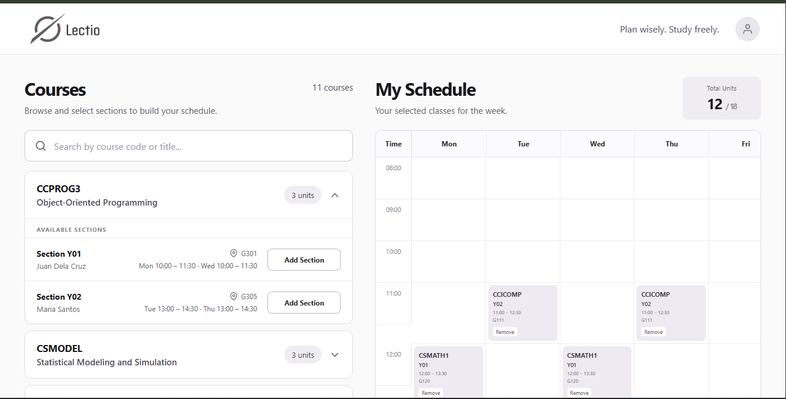

# Lectio — Class Scheduler

A React class scheduling application for browsing courses, selecting sections, and building a weekly schedule.

**Live Demo:** [https://lectio-virid-seven.vercel.app/](https://lectio-virid-seven.vercel.app/)

## Features

- Browse courses and sections
- Search by course code, title, or instructor
- One selected section per course
- Switch between sections of the same course
- Maximum unit limit (18 by default)
- Remove selected sections
- Weekly timetable
- Selected classes summary
- Empty states and feedback messages
- Responsive layout

## Built With
- React 19
- Vite
- JavaScript (ES6+)
- Native CSS3

## Run locally

```bash
npm install
npm run dev
```

## Technical Rationale
The project was developed using React with Vite to create a component-based and responsive class scheduling interface. The application is divided into reusable components such as the course list, course cards, section cards, and schedule, making the code easier to maintain and extend.

React state management using `useState` is used to track selected sections, search input, and the current number of units. `useMemo` is used for filtering course data based on the search query. The selection logic ensures that only one section can be selected per course and prevents the total units from exceeding the 18-unit limit.

Course information is stored separately in a JavaScript mock data file, keeping the data independent from the UI components. No backend was used since the assessment allows mock data. The weekly schedule is generated from the selected sections and displayed in a timetable layout.    
